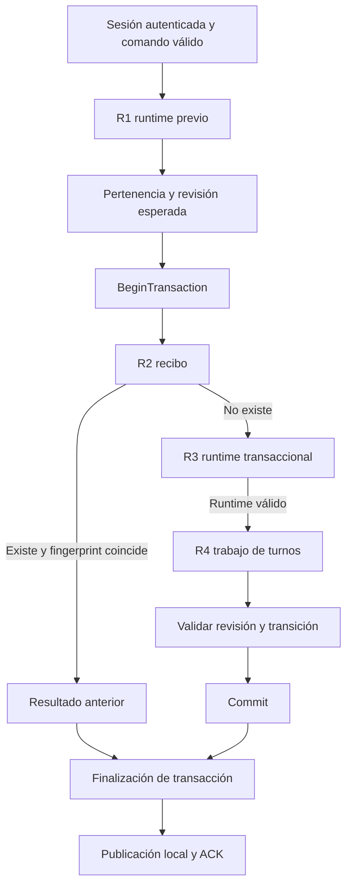

# SERVER-7 / S7-09 — Firestore transaction read review

**S7_09_SUCCESS=YES — revisión de arquitectura, sin implementación ni carga.**

La ruta normal hace **cuatro lecturas documentales secuenciales**: una lectura previa del runtime, seguida de recibo, runtime y trabajo de turnos dentro de la transacción. No consulta el documento raíz de Match, documentos individuales de participantes, eventos ni perfiles. El mismo runtime se lee dos veces, pero la primera lectura fija la revisión esperada y la segunda valida esa revisión con estado autoritativo transaccional; eliminar la primera sin rediseñar ese contrato no es una optimización segura.

El candidato más pequeño es **mantener el recibo primero y agrupar las lecturas de runtime y trabajo mediante el getAll de la misma transacción**. Conserva cuatro documentos leídos y reduce las rondas lógicas de lectura de cuatro a tres en el camino normal. Impacto esperado MEDIUM, sin prometer milisegundos. Requiere cambios y pruebas en otra fase autorizada; aquí no se implementó.

## Alcance y fuentes

Se revisó PLAY_TILE, representativo de los comandos aceptados medidos en S7-08; PASS y NEXT_ROUND atraviesan las mismas lecturas de repositorio. No se incluyen como si fueran lecturas de cada comando las operaciones de autenticación inicial, matchmaking, resync REST, worker de turnos o Replay.

- [Entrada WebSocket y ACK](D:/Fredy/development/2026/domino/server/domino/src/main/kotlin/com/teamfho/domino/realtime/RealtimeHandler.kt:163).
- [Lectura previa, autorización y revisión esperada](D:/Fredy/development/2026/domino/server/domino/src/main/kotlin/com/teamfho/domino/online/OnlineMatchService.kt:58).
- [Lecturas, validación y escrituras transaccionales](D:/Fredy/development/2026/domino/server/domino/src/main/kotlin/com/teamfho/domino/online/OnlineRepository.kt:120).
- [Autorización y reglas de la transición](D:/Fredy/development/2026/domino/server/domino/src/main/kotlin/com/teamfho/domino/online/OnlineEngine.kt:27).
- [Estado privado autoritativo](D:/Fredy/development/2026/domino/server/domino/src/main/kotlin/com/teamfho/domino/online/OnlineModels.kt:22), [modelo de Match y participantes](D:/Fredy/development/2026/domino/server/domino/src/main/kotlin/com/teamfho/domino/match/MatchModels.kt:24).
- [Descubrimiento periódico y presencia](D:/Fredy/development/2026/domino/server/domino/src/main/kotlin/com/teamfho/domino/online/OnlineTurnWorker.kt:21).
- [Análisis S7-08 preservado](D:/Fredy/development/2026/domino/client/Validation/Generated/S708/analysis.json), [informe S7-08](D:/Fredy/development/2026/domino/client/Validation/S7_08_FIRESTORE_CRITICAL_PATH_REPORT.md), bytecode del SDK ya capturado en `Generated/S708/sdk-transaction.txt` y `sdk-firestore.txt`.

Las rutas documentales de este informe usan únicamente marcadores de posición; no se publican identificadores reales. Los cambios preexistentes del workspace no son cambios realizados por S7-09.

## Inventario en orden exacto

Antes de R1, el handler verifica la sesión autenticada, analiza el comando y valida su forma. El UID procede de la conexión, no de un campo controlado por el comando. No se hace una lectura Firestore adicional para autenticar cada MATCH_COMMAND.

| READ_ID | Colección/documento | Tipo | Propósito | Transaccional | Condicional |
|---|---|---|---|---|---|
| R1 | `matches/{match}/runtime/authoritative` | Document get, invoca BatchGetDocuments en el SDK | Comprobar existencia y pertenencia; obtener `match.lastSequence` para fijar `expectedSequence` antes de la transacción | NO | NO en la ruta válida; los rechazos anteriores hacen cero lecturas |
| R2 | `matches/{match}/commands/{command}` | Transaction get | Detectar recibo existente y validar fingerprint ligado a UID + contenido del comando; devolver el resultado previo sin repetir la transición | SÍ | Se alcanza solo después de R1 y de su autorización |
| R3 | `matches/{match}/runtime/authoritative` | Transaction get | Reconstruir estado privado; comprobar la revisión esperada; ejecutar autorización, turno, deadlines y reglas sobre estado transaccional actual | SÍ | Solo si R2 no encontró recibo |
| R4 | `onlineTurnWork/{match}` | Transaction get | Conservar `presenceCheckAt` al recalcular la programación duradera; si falta, aplicar el fallback existente | SÍ | Solo si no existe recibo y R3 produjo un runtime válido |

Después de R4 se compara `lastSequence == expectedSequence`, se calcula y valida la transición, se acumulan las escrituras y se espera el commit. Después se actualizan observaciones de presencia en memoria y se encolan eventos autorizados; finalmente se encola ACK. **Lecturas Firestore posteriores al commit: cero.** Las operaciones de mapas, DTO, snapshots ya cargados y buffers de escritura no son lecturas remotas.

R4 se ejecuta antes de rechazar una revisión obsoleta y también antes de saber si la transición terminará la partida. No hay un atajo de lectura para el último comando. Una repetición idempotente autorizada se resuelve después de R2: no ejecuta R3/R4 ni vuelve a ejecutar el engine. Su fingerprint impide que otro actor reutilice el recibo como si fuera suyo.

## Conteos y rondas

Los conteos siguientes son invocaciones lógicas de lecturas documentales de aplicación, no paquetes ni una factura de Firestore. Un get de un documento inexistente también es una solicitud de lectura. Los reintentos internos de RPC no están contados.

| Caso | Gets fuera de transacción | Transaction gets | Queries | Post-commit reads | Total / rondas lógicas actuales |
|---|---:|---:|---:|---:|---:|
| Comando rechazado antes de acceder al repositorio | 0 | 0 | 0 | 0 | 0 / 0 |
| Match inexistente o no participante en R1 | 1 | 0 | 0 | 0 | 1 / 1 |
| Recibo repetido aceptado, sin retry | 1 | 1 | 0 | 0 | 2 / 2 |
| Comando nuevo aceptado, un intento | 1 | 3 | 0 | 0 | **4 / 4** |
| Camino nuevo que alcanza tres gets en cada uno de A intentos | 1 | 3A | 0 | 0 | **1 + 3A**, A ≤ 8 |

Máximo lógico de esta ruta con la política actual: **25** gets para ocho callbacks que alcancen los tres gets; algunos intentos fallan antes y consumen menos. No es un máximo de intentos de red, lecturas facturadas, listeners o trabajo de otros subsistemas. Mínimo normal nuevo exitoso: 4; mínimo ACK idempotente exitoso: 2; mínimo de cualquier solicitud, incluyendo rechazos tempranos: 0. Los 961 comandos medidos tuvieron un intento y tres lecturas transaccionales, además de R1.

BeginTransaction y Commit son interacciones remotas adicionales pero **no rondas de lectura**. Por ello las seis interacciones lógicas normales de S7-08 son compatibles con las cuatro rondas de lectura de este informe.

## Dependencias y posible agrupación



| Relación | Clasificación | Explicación |
|---|---|---|
| R1 → transacción | MUST_BE_SEQUENTIAL | R1 fija el valor de revisión esperado y filtra pertenencia. Eliminar esta frontera cambia la ventana de carrera |
| R2 → R3/R4 | CONDITIONAL / MUST_BE_SEQUENTIAL para conservar el atajo | Un recibo existente evita ambas lecturas y la transición; agrupar los tres documentos ampliaría el conjunto leído/bloqueado de duplicados |
| Referencia R3 frente a referencia R4 | INDEPENDENT | Ambas se construyen a partir del match del comando; ninguna necesita campos del resultado de la otra para localizar el documento |
| R3 → R4 actual | CONDITIONAL | El código actual no lee trabajo si el runtime falta o no se puede decodificar |
| R3 + R4 para un Match válido, después de R2 | CAN_BE_PARALLEL en sentido de batch transaccional | Candidato: un `tx.getAll` para ambos documentos, no dos hilos compartiendo Transaction ni gets fuera de ella |
| R3/R4 → escrituras | MUST_BE_SEQUENTIAL | Deben completarse las lecturas y validaciones antes de acumular escrituras |

El SDK instalado ya expone getAll transaccional, propaga el identificador de transacción a FirestoreImpl.getAll y comprueba que no haya escrituras anteriores. La API oficial también documenta ese método; todas las lecturas deben preceder a las escrituras. Esta posibilidad no demuestra una mejora de latencia ni garantiza igual orden de adquisición de locks. [Java Transaction](https://docs.cloud.google.com/java/docs/reference/google-cloud-firestore/latest/com.google.cloud.firestore.Transaction), [transacciones Firestore](https://firebase.google.com/docs/firestore/manage-data/transactions).

El batch propuesto mantiene los mismos documentos del camino normal, pero puede leer R4 cuando R3 no exista o esté corrupto. Antes de implementarlo deben especificarse y probarse los códigos de error, las respuestas parciales/ausentes, el mapeo por referencia y los fallos de almacenamiento. No se presupone que la API agregada conserva automáticamente todos los errores observables actuales.

## Qué información se relee

**Root frente a runtime.** No se lee `matches/{match}` como documento raíz durante el comando; se escribe al persistir la transición. R1/R3 leen un documento de runtime que contiene un Match completo dentro de `stateJson`, junto con manos, reserva, tablero, ronda y campos de ejecución. `abandonmentLifecycleVersion` se conserva como metadato hermano del JSON. Es una reconstrucción de un documento, no un replay de eventos. Se necesitan revisión, fase/estado, actor/turno, fichas, tablero, puntuación, deadlines, participantes y reglas congeladas para autorizar y calcular la transición.

**Participantes.** Cero documentos `players/{seat}` leídos. Sus datos ya están incluidos en R1/R3. El repositorio compara los participantes de R3 con los de la transición para escribir únicamente los documentos individuales que cambian. No vuelve a leer estos documentos para compararlos. La asignación de UID, asiento, equipo y tipo de control queda estable en una partida activa de cuatro jugadores; durante la formación se agregan asientos. Desconexión, deadline y abandono sí cambian y afectan el permiso de jugar. La identidad autenticada llega de la sesión; su autorización sobre la partida se comprueba con los participantes del estado.

**Reglas.** Sí se transfieren de nuevo las reglas congeladas embebidas en cada runtime, dos veces por comando nuevo. No hay gets de catálogo ni documentos de reglas. Ya están fotografiadas al crear el Match y protegidas por hash y validaciones de invariancia; separarlas o cachearlas no elimina automáticamente el get que necesita el estado mutable.

**Eventos.** Cero eventos existentes leídos y cero queries de eventos. Se crean eventos nuevos en el mismo commit. El coste de lecturas documentales del comando es O(1) respecto al número de eventos históricos, aunque el tamaño/decodificación del estado y el número de escrituras no son necesariamente constantes. Recorrer participantes en memoria no añade O(players) gets.

**Presencia.** R1/R3 incluyen estado de conexión y deadlines de los asientos. R4 lee una programación duradera, no el heartbeat o la presencia en vivo. Se conserva `presenceCheckAt` al calcular el mínimo entre el próximo chequeo, el deadline de turno y los deadlines de reconexión. Sustituirlo por “ahora + 30 s” en cada jugada podría posponer reiteradamente la comprobación de presencia; usar solo el deadline de turno tampoco cubre todas las fases. El worker vuelve a programar el chequeo después de procesarlo. El camino normal de ACK no consulta Redis, leases ni heartbeats directamente.

**Perfil y plan.** No se leen perfil, plan, entitlements ni datos sociales desde Firestore en cada comando. El nombre visible es un snapshot embebido; observar presencia social después del commit actualiza un mapa local. La lectura de perfiles para crear/juntar jugadores y otras peticiones sociales son caminos distintos.

### Clasificación de campos leídos

Las categorías pueden solaparse por función; no representan lecturas documentales adicionales.

| Categoría | Campos/información y grupo |
|---|---|
| IMMUTABLE_FOR_MATCH | En R1/R3: identidad del Match, createdAt, modo/executionMode, versiones de catálogo/reglas/topología, ruleSnapshot y hash, validationData, marcador de lifecycle; asignación de asientos/equipos/control y joinedAt una vez formada la partida |
| MUTABLE_GAMEPLAY | En R1/R3: status, phase, starter/selections, manos, reserva, tablero, pases, ronda, turnos, currentSeat, score, result, lastSequence, multiplicador, tiempos de turno/finalización/actualización |
| MUTABLE_AUTHORIZATION | En R1/R3: elegibilidad ligada a estado terminal, turno, abandono y vencimiento de reconexión; pertenencia se amplía durante formación pero no se reasigna durante gameplay normal |
| MUTABLE_CONNECTION | En R1/R3: connectionState, disconnectedAt, reconnectDeadlineAt, abandonedAt |
| PRESENTATION_ONLY | displayNameSnapshot de participantes, transportado dentro de R1/R3; no es otra lectura de perfil |
| OTHER | R2: fingerprint y secuencias del recibo, persistido e inmutable tras creación; R4: presenceCheckAt, dueAt y uids transportados, aunque solo presenceCheckAt se extrae; visibility/spectatorPolicy y otros metadatos del Match no consultan un documento adicional |

**Duplicación semántica:** R1 y R3 recuperan el mismo runtime completo, en momentos/ámbitos de consistencia distintos. Hay copias persistidas del Match y participantes en root/subdocumentos, pero no se leen esas copias en esta ruta. **Duplicación dentro del mismo intento transaccional: ninguna.** R3/R4 se repiten con cada comando nuevo y con retries; R2 normalmente apunta a un recibo diferente por comando y solo se repite en reentregas/retries.

## Necesidad transaccional y candidatos

| READ_GROUP | CURRENT_REASON | CRITICALITY | CHANGE_POSSIBILITY | EXPECTED_LATENCY_RELEVANCE | RISK |
|---|---|---|---|---|---|
| R1 pre-read | Autorización preliminar y fijar expectedSequence | Alta por revisión, no solo pertenencia | NO_CHANGE_RECOMMENDED. Es CAN_BE_OUTSIDE_TRANSACTION_BUT_MUST_BE_VALIDATED, como ahora. No clasificar su eliminación como una duplicación inocua | Quitar una ronda sería relevante, pero cambiaría el contrato | Alta: en un retry podría aceptar la jugada contra una revisión posterior; el DTO no aporta una revisión autoritativa alternativa |
| R2 recibo | Idempotencia, resultado previo y vinculación al actor/payload | Crítica | KEEP_TRANSACTIONAL / MUST_BE_INSIDE_TRANSACTION | Una ronda, no aislada por S7-08 | Sacarlo de la transacción permitiría carreras y perdería el atajo autoritativo; cache local no basta |
| R3 runtime | Estado y revisión autoritativa, turno, permiso, reglas, finalización | Crítica | KEEP_TRANSACTIONAL / MUST_BE_INSIDE_TRANSACTION | Parte de las tres lecturas medidas | Sacarlo o confiar en R1 permite estado obsoleto y conflictos entre instancias |
| R4 trabajo | Preservar programación duradera al actualizarla junto con estado | Alta para recuperación/presencia | KEEP_TRANSACTIONAL. No CAN_BE_DERIVED_FROM_TRANSACTIONAL_STATE hoy: el runtime no contiene presenceCheckAt | Parte de las tres lecturas medidas | Sacarlo permite perder actualizaciones del worker; recomputarlo puede posponer chequeos; trasladar el campo requiere otro diseño/esquema |
| R3 + R4 después de R2 | Dos referencias independientes en la misma transacción | Conserva ambas garantías | **KEEP_TRANSACTIONAL, agrupación mediante getAll**; no se elimina documento alguno | Una ronda menos: 4→3 rondas totales, 3→2 transaccionales; MEDIUM direccional | MEDIUM: errores, locks, missing runtime/work, retries y métricas requieren pruebas |
| Reglas y datos estables embebidos | Coherencia con estado y snapshots históricos | Alta para reproducibilidad | SNAPSHOT_AT_MATCH_CREATION ya aplicado; NO_CHANGE_RECOMMENDED para cache/separación en esta fase | No elimina un get por sí solo; podría afectar bytes/CPU, no demostrado | Evitar desacoplar reglas de su versión/hash y convertir caché de proceso en autoridad |

No hay una lectura que pueda eliminarse ahora con evidencia suficiente de equivalencia. La recomendación principal reduce **rondas**, no el número de documentos ni el coste lógico por comando.

### Invariantes para cualquier fase siguiente

1. Cada intento debe usar lecturas de su propia transacción; nunca reutilizar snapshots de un intento fallido. Mantener el mismo expectedSequence fijado antes del retry y el mismo límite de intentos.
2. Mantener el recibo como primera decisión. Duplicado válido retorna el resultado previo; fingerprint distinto rechaza. No publicar nada antes del commit.
3. Validar UID/asiento, abandono/reconexión, turno, timeout, fase, fichas y secuencia sobre R3. No aceptar UID/asiento/puntuación/reglas/revisión arbitrarios del cliente.
4. Persistir estado, eventos, recibo, rondas, History y trabajo como una unidad. Mantener finalización y cancelación, y conservar ausencia de History normal para abandono.
5. Conservar la lectura transaccional de presenceCheckAt para no sobrescribir una programación concurrente del worker; falta de trabajo conserva el fallback actual. Ningún cambio en deadlines o ventanas de reconexión.
6. Dos instancias deben seguir resolviendo contención mediante Firestore. No usar una caché de proceso ni Redis como autoridad alternativa. Un batch debe permanecer dentro de la misma transacción y antes de las escrituras.

La aplicación fija revisión y revalida en cada intento; eso no implica que el SDK servidor use el mismo control optimista que el cliente móvil. El modo de concurrencia de la base no se ha establecido en esta auditoría y no se asume. La documentación distingue el comportamiento de las bibliotecas servidor y destaca la importancia de proximidad a la base. [Contención y transacciones](https://cloud.google.com/firestore/docs/transaction-data-contention).

## Correspondencia con S7-08

| Grupo | 20 usuarios: muestras / p50 / p95 / p99 / max ms | 40 usuarios: muestras / p50 / p95 / p99 / max ms |
|---|---|---|
| R1 aislada | 347 / 60 / 129 / 174 / 236 | 614 / 76 / 172 / 226 / 531 |
| R2 + R3 + R4, agregado | 347 / 180 / 344 / 420 / 501 | 614 / 227 / 465 / 615 / 945 |

**PER_READ_TIMING_AVAILABLE=PARTIAL:** R1 sí; R2, R3 y R4 individualmente no. Para las tres lecturas transaccionales, **PER_READ_TIMING_AVAILABLE=NO**. No dividir 465 ms entre tres para atribuir p95 a documentos individuales. El 61,2 % es la participación acumulada de R1 + el agregado transaccional en FS_TOTAL, no un percentil sumado. Las 961 muestras tuvieron exactamente tres gets transaccionales y cero reejecuciones del callback: la latencia aumentó con la concurrencia mientras el conteo lógico permaneció constante.

S7-08 conserva una muestra de residual cliente–servidor negativo; no afecta el conteo de gets ni habilita atribuir estas esperas a Cloudflare. No se reutiliza el residual como RTT de Firestore.

Firestore está en **us-central1**, según metadata autoritativa de S7-08. El backend descrito es una VM Ubuntu local en VirtualBox sobre el host del usuario, con salida de red hacia Google; no hay evidencia suficiente de su ciudad, distancia física, peering o RTT base. La zona horaria del equipo no prueba su ubicación. Las rondas secuenciales acumulan espera del cliente/SDK/red/servicio; no se afirma que toda esa espera sea propagación geográfica ni se propone migración de región en S7-09.

## Estimación descriptiva de lecturas

Para C comandos nuevos aceptados con un intento: **4C solicitudes documentales**. Con reentregas idempotentes autorizadas D: aproximadamente 4C + 2D, más las lecturas de intentos adicionales y rechazos según su punto de salida. Esto excluye creación, matchmaking, auth/bootstrap, worker, listeners, resync, History/Replay y otros subsistemas. No es una predicción de facturación ni incluye retries de RPC.

S7-08 observó 961 ACK nuevos en diez partidas parciales que terminaron canceladas: **3844 gets lógicos**, media **384,4 por partida parcial**. Repetir cien veces una población con esa misma duración/comportamiento parcial daría **38440 gets**. No se presenta como coste de cien partidas completas: los comandos por partida completa no se determinaron aquí. Para partidas completas, las expresiones honestas son **4C por Match y 400C por 100 Matches**, donde C debe medirse. El batch candidato mantiene esas cifras.

## Contratos de pruebas existentes y brechas

Se inspeccionaron las pruebas; **no se ejecutó ninguna prueba ni carga nueva en S7-09**. La existencia de un test no se presenta como ejecución satisfactoria en esta fase. Los tests EMULATOR/Redis requieren sus entornos y deben incluirse en una futura validación autorizada.

| Lecturas/contrato | Pruebas existentes inspeccionadas | Qué sostienen |
|---|---|---|
| R1 + R3 revisión y turno | `OnlineMatchTests`: “server frozen revision prevents two raced moves and out of turn actor”, “cross player raced requests cannot consume two turns from one revision” | Una revisión no admite dos transiciones competidoras; autorización de turno |
| R2 deduplicación | `OnlineMatchTests`: “duplicate command durable receipt conflict and UID binding”; `FirestoreEmulatorTests`: “participant optimization retains firestore race receipts and command conflicts” | Repetición sin transición, conflicto de payload/actor, carrera real de repositorio |
| R3 participantes/reglas/estado | `OnlineHttpTests`: “strict command parser rejects UID and score tampering”; `OnlineMatchTests`: “catalog changes do not alter active online rules…” y “complete matches scoring history strict sequence…”; `ParticipantPersistenceTests` | Autoridad del servidor, reglas congeladas, History/eventos, comparación estructural de participantes |
| R3 deadlines/abandono | `OnlineTurnTests`: “late command rejected at abandonment boundary before worker runs”, “179 180 abandonment boundary…” | No revivir asientos ni aceptar comandos después del plazo |
| R3/R4 recuperación y concurrencia | `FirestoreEmulatorTests`: “persisted expired turn recovers across service restart and concurrent workers”; `TurnIndexTests`: “backend restart and redis loss rebuild persisted expired deadline”; `AllAbandonedEmulatorTests`: “two instances last abandonment commits one cancellation no history and deletes work” | Recuperación duradera, ganadores concurrentes y eliminación de trabajo terminal |
| R3/R4 race conexión | `AllAbandonedEmulatorTests`: “reconnect just before grace versus expiry transaction has coherent winner” | Consistencia de reconexión y cancelación entre instancias |
| Instrumentación | `FirestorePhaseTimingTest`, `AckPhaseTimingTest`; evidencia S7-08 | Particiones y agregado; no prueba la equivalencia de un futuro batch |

Brechas del candidato: verificar exactamente un getAll para R3/R4 después de R2; ningún getAll en duplicados; mismo expectedSequence en retries; mapeo de snapshots por referencia; runtime ausente/corrupto, trabajo ausente y errores del SDK; carrera entre comando y refreshDiscovery preservando presenceCheckAt; demostrar que comandos continuos no posponen el chequeo periódico; conteo de rondas separado del conteo de documentos. Añadir cobertura explícita si los tests actuales no afirman esos puntos. También habría que adaptar el contador de tests que intercepta gets individuales y la instrumentación para que un batch no se contabilice falsamente como un documento. Nada de esto fue implementado.

## Resultado requerido

```text
SERVER-7 S7-09 FIRESTORE TRANSACTION READ REVIEW
================================================
GAMEPLAY_COMMAND_READ_SEQUENCE=R1_RUNTIME_PRE_READ > R2_RECEIPT_TX > R3_RUNTIME_TX > R4_TURN_WORK_TX > COMMIT > LOCAL_PUBLISH > ACK
MIN_FIRESTORE_READS_PER_COMMAND=0_EARLY_REJECT; 2_ACCEPTED_DUPLICATE; 4_NEW_SUCCESS
TYPICAL_FIRESTORE_READS_PER_COMMAND=4_DOCUMENT_GETS_TOTAL_1_OUTSIDE_3_TRANSACTIONAL
MAX_FIRESTORE_READS_PER_COMMAND=25_APPLICATION_GETS_AT_8_ATTEMPTS; INTERNAL_RPC_RETRIES_EXCLUDED
REMOTE_READ_ROUNDS_PER_COMMAND=4_NORMAL; 2_DUPLICATE; QUERIES_0; POST_COMMIT_0
MATCH_ROOT_READ_EVERY_COMMAND=NO_ROOT_DOCUMENT; YES_MATCH_DATA_EMBEDDED_IN_RUNTIME
PARTICIPANT_READS_PER_COMMAND=0_STANDALONE; EMBEDDED_IN_R1_R3
FROZEN_RULES_READ_EVERY_COMMAND=YES_EMBEDDED_IN_RUNTIME; NO_CATALOG_READ
AUTHORITATIVE_GAME_STATE_READS=R3_SINGLE_RUNTIME_DOCUMENT; R1_EARLIER_REVISION_CHECK
EVENTS_READ_PER_COMMAND=0
EVENT_QUERY_PER_COMMAND=0
IDEMPOTENCY_READS_PER_COMMAND=1_R2_PER_ATTEMPT
AUTHORIZATION_READS_PER_COMMAND=R1_AND_R3_OVERLAPPING_EXISTING_GETS; NO_ADDITIONAL_DOCUMENTS
PRESENCE_READS_ON_COMMAND_PATH=R1_R3_EMBEDDED_CONNECTION_STATE_AND_R4_SCHEDULE; LIVE_PRESENCE_0
NON_GAMEPLAY_READS_ON_COMMAND_PATH=0_PROFILE_PLAN_ENTITLEMENT_SOCIAL_DOCUMENTS
IMMUTABLE_FOR_MATCH_READS=FROZEN_RULES_MATCH_METADATA_AND_FORMED_ROSTER_EMBEDDED_IN_R1_R3
MUTABLE_GAMEPLAY_READS=R1_R3_RUNTIME
MUTABLE_AUTHORIZATION_READS=R1_R3_STATE_CONNECTION_AND_TURN_ELIGIBILITY
MUTABLE_CONNECTION_READS=R1_R3_PARTICIPANT_CONNECTION_FIELDS
PRESENTATION_ONLY_READS=DISPLAY_NAME_SNAPSHOT_EMBEDDED_NO_EXTRA_GET
DUPLICATE_SEMANTIC_READS=RUNTIME_R1_R3_WITH_DISTINCT_REVISION_AND_TRANSACTION_ROLES
DUPLICATE_DOCUMENT_READS_SAME_TRANSACTION=0_PER_ATTEMPT
STABLE_DATA_REREAD_EVERY_COMMAND=RULES_AND_ROSTER_EMBEDDED_IN_MUTABLE_RUNTIME
PER_READ_TIMING_AVAILABLE=NO_FOR_INDIVIDUAL_R2_R3_R4; YES_FOR_R1
READ_COMPLEXITY_VS_MATCH_LENGTH=O(1)_DOCUMENT_GETS_NOT_A_BYTE_OR_CPU_BOUND
READ_COUNT_CHANGES_WITH_CONCURRENCY=NO_961_SAMPLES_ONE_ATTEMPT_THREE_TX_GETS_PLUS_R1
MULTI_INSTANCE_CONSTRAINTS=TRANSACTIONAL_RUNTIME_RECEIPT_WORK; FIXED_EXPECTED_SEQUENCE; NO_PROCESS_LOCAL_AUTHORITY
ESTIMATED_READS_PER_GAMEPLAY_COMMAND=4_NORMAL_NEW_ONE_ATTEMPT
ESTIMATED_READS_PER_MATCH=4C_FULL_MATCH; 384.4_OBSERVED_MEAN_PARTIAL_CANCELLED_MATCH
ESTIMATED_READS_PER_100_MATCHES=400C_FULL_MATCH; 38440_ONLY_IF_REPEATING_S708_PARTIAL_WORKLOAD
READ_DEPENDENCY_TEST_COVERAGE=EXISTING_SOURCE_CONTRACTS_MAPPED; BATCH_AND_PRESENCE_SCHEDULE_GAPS_IDENTIFIED; NOT_RUN_HERE
CANDIDATES=KEEP_R1_REVISION; KEEP_R2_RECEIPT; KEEP_R3_RUNTIME; KEEP_R4_SCHEDULE; BATCH_R3_R4_AFTER_R2; RULE_SNAPSHOT_ALREADY_IMPLEMENTED
PRIMARY_READ_OPTIMIZATION_CANDIDATE=TRANSACTION_GETALL_RUNTIME_AND_WORK_AFTER_RECEIPT_SHORT_CIRCUIT
EXPECTED_IMPACT=MEDIUM_DIRECTIONAL_ONE_FEWER_READ_ROUND_NO_DOCUMENT_READ_REDUCTION
OPTIMIZATION_RISK=MEDIUM_BOUNDED_ERRORS_LOCKING_RETRIES_AND_METRIC_ACCOUNTING
SOURCE_CHANGE_REQUIRED_FOR_NEXT_PHASE=YES_ONLY_IF_SEPARATELY_AUTHORIZED
BACKEND_SOURCE_CHANGED=NO
CLIENT_SOURCE_CHANGED=NO
NEW_LOAD_EXECUTED=NO
SERVER7_100_RERUN_STARTED=NO
SERVER7_250_STARTED=NO
SERVER_CONFIGURATION_CHANGED=NO
COMMIT=NONE
PUSH=NONE
S7_09_SUCCESS=YES
NEXT=S7-09 REVIEW
```
